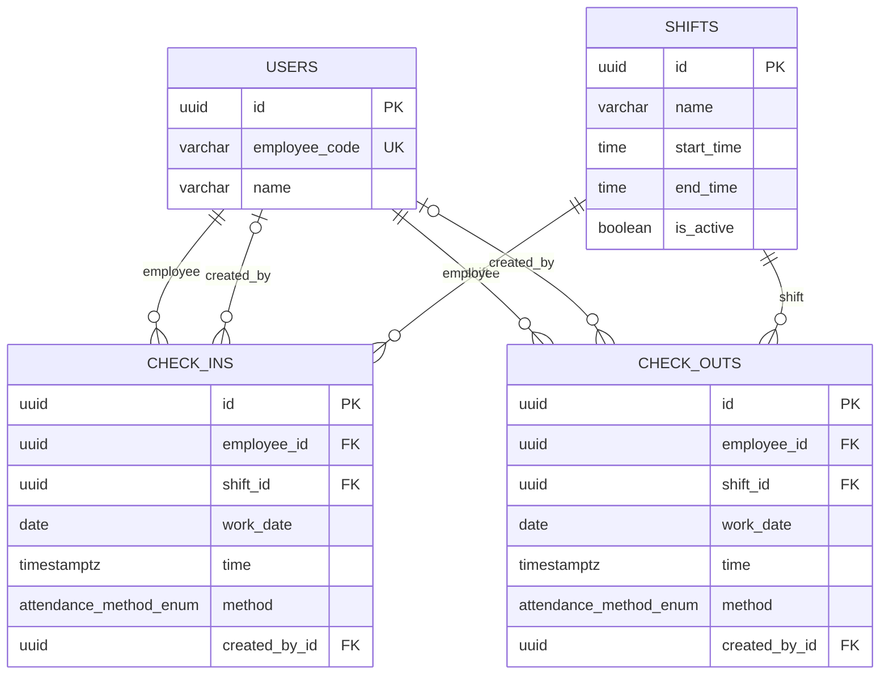
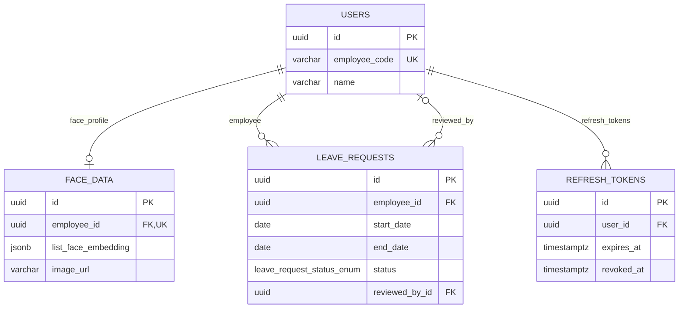
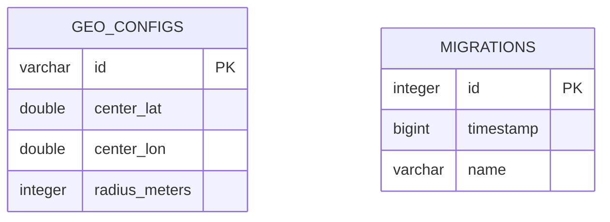

# API Database ERD

Generated from `apps/api/schema.sql`.

## Attendance Events

## Employee Support

## Standalone Tables

## Table Columns

| Table | Columns |
| --- | --- |
| `users` | `id`, `employee_code`, `name`, `password_hash`, `account_role`, `department`, `job_title`, `phone`, `email`, `date_of_birth`, `created_at`, `updated_at` |
| `shifts` | `id`, `name`, `start_time`, `end_time`, `is_active`, `created_at`, `updated_at` |
| `check_ins` | `id`, `employee_id`, `shift_id`, `work_date`, `time`, `latitude`, `longitude`, `method`, `image_path`, `is_out_of_zone`, `created_by_id`, `created_at`, `updated_at` |
| `check_outs` | `id`, `employee_id`, `shift_id`, `work_date`, `time`, `latitude`, `longitude`, `method`, `image_path`, `is_out_of_zone`, `created_by_id`, `created_at`, `updated_at` |
| `face_data` | `id`, `employee_id`, `list_face_embedding`, `image_url`, `updated_time`, `created_at`, `updated_at` |
| `leave_requests` | `id`, `employee_id`, `start_date`, `end_date`, `reason`, `status`, `reviewed_by_id`, `reviewed_at`, `rejection_reason`, `created_at`, `updated_at` |
| `refresh_tokens` | `id`, `user_id`, `token_hash`, `expires_at`, `revoked_at`, `created_at` |
| `geo_configs` | `id`, `center_lat`, `center_lon`, `radius_meters`, `created_at`, `updated_at` |
| `migrations` | `id`, `timestamp`, `name` |

## Relationship Notes

- `users.employee_code` is unique.
- `face_data.employee_id` is unique, so each user can have at most one face profile.
- `check_ins.created_by_id`, `check_outs.created_by_id`, and `leave_requests.reviewed_by_id` are nullable and use `ON DELETE SET NULL`.
- `face_data.employee_id` and `refresh_tokens.user_id` use `ON DELETE CASCADE`.
- `geo_configs` and `migrations` have no foreign-key relationships in this dump.
- `shifts` has a partial unique index on active shifts: only one row can have `is_active = true`.
